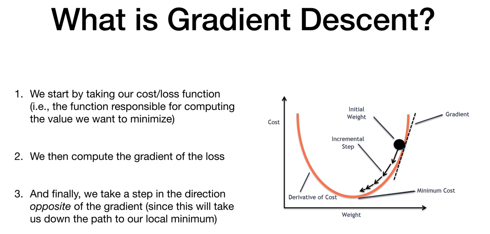
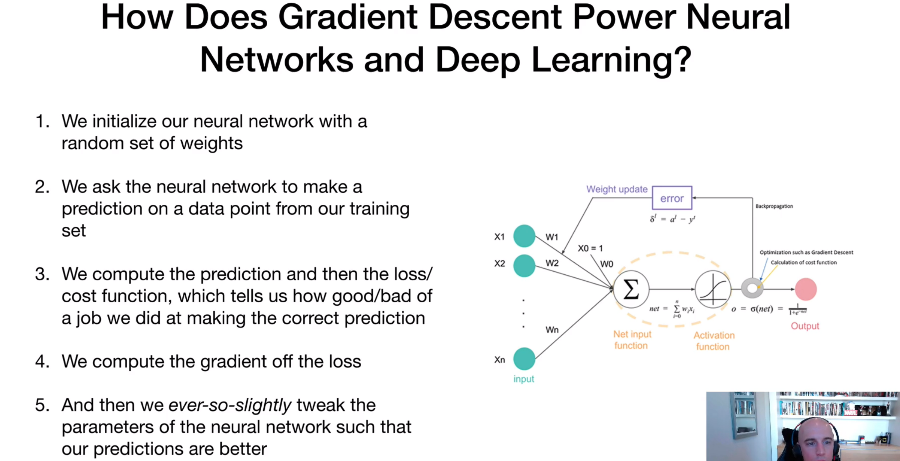
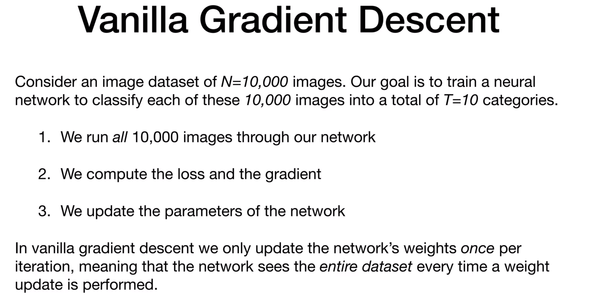
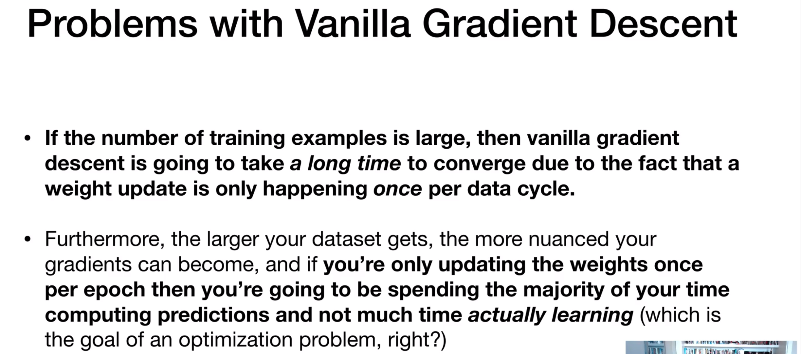
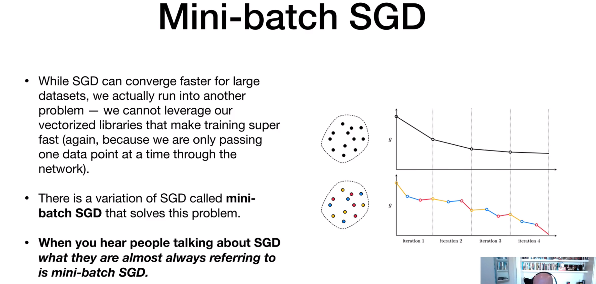
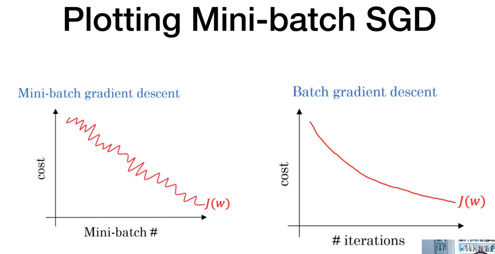
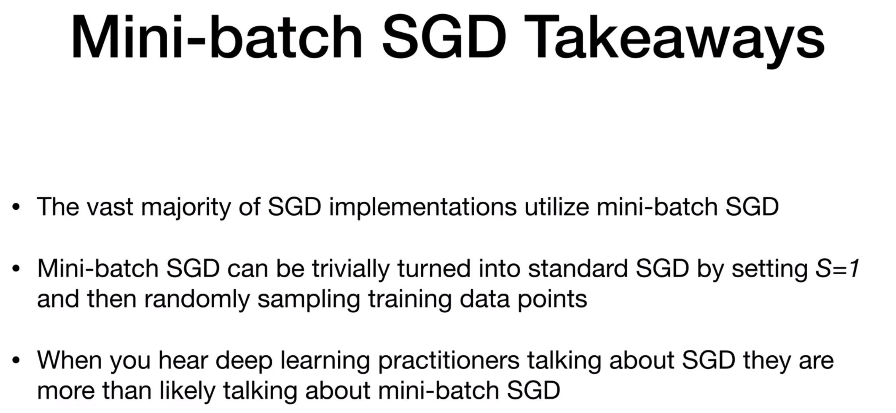
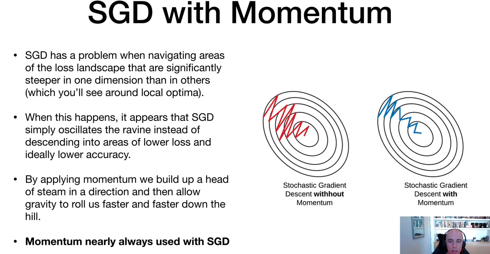
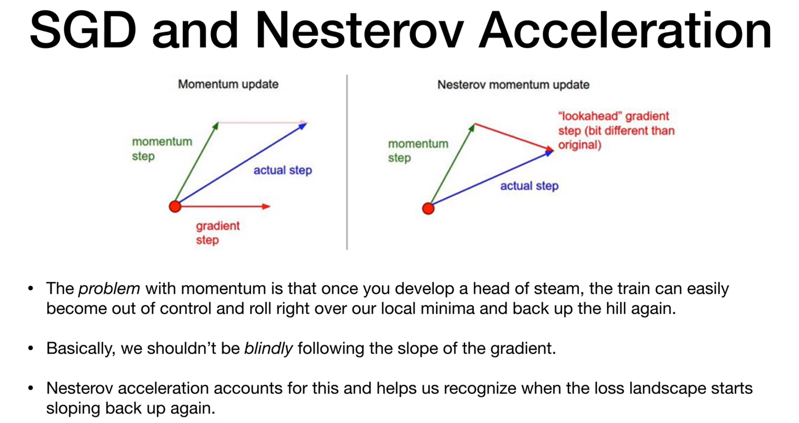
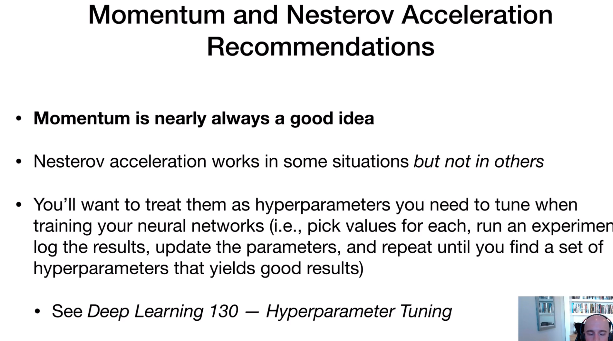

# stochastic-gradient-descent

1. In SGD, suppose if we have 1000 records. It will pass each one one record at a time. 
2. If we have epoch size 100,
        to complete 1 epoch, it will update 1000 times a weight update (bcz single record will feed to the network).
        In order to complete 100 epochs : 100 * 1000 = 100000 times weight updation will happen. So this is time consuming

# Mini-batch stochastic-gradient-descent
1. Here, we pass set of records to the network.
2. We specify the batch-size 2^ (2 to the power), bcz it computes fast. Ex: batch-size - 8, 32, 512...
3. If we have total number of records 1000, batch-size 32
   1000/32 = 31
    - In each epoch with the batch-size 32, 31 times records will feed to the network.
    - And there will be a 31 times weight updation will happen in one epoch
    - for total 100 epocs : 100 * 31 = 3100 times weight updation will happen

Prons:
Mini-batch SGD will produce a noice. In order to reach global-minima.

# Mini-baatch SGD with Momentum
1. With this we are over comming the noise which produced in mini-batch SGD

prons: 
1. The problem with momentum is that once you develop a head of stem,
the train can easily become out of control and roll right over our local
minima and back up the hill again.
2. Basically we shldn't be blindly following the slope of the gradient.

# Nesterov Acceleration
1. Nesterov acceleration accounts for this and helps us recognize when the loss
landscape starts sloping back up again

## Quick look over Gradient-descent and it's varient

